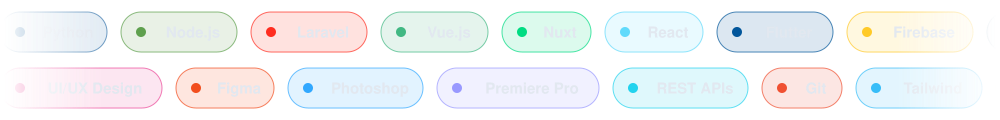
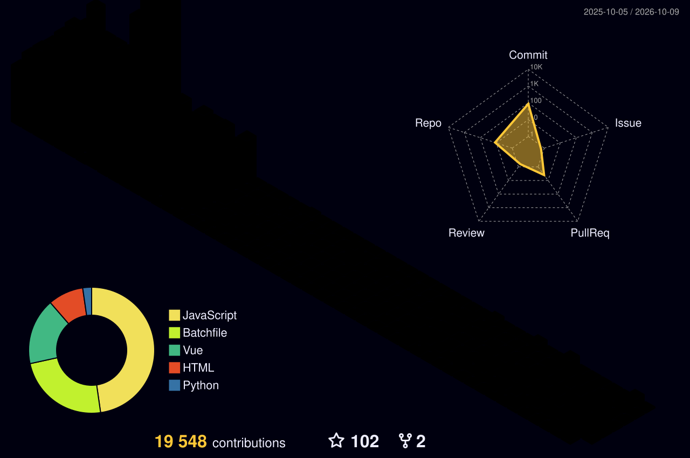

<!-- ═══════════════════════════ HERO BANNER (animated SVG) ═══════════════════════════ -->
<p align="center">
  
</p>

<p align="center">
  <a href="https://github.com/Sengkue">
    
  </a>
</p>

<p align="center">
  
  
  
  
</p>

<p align="center">
  <a href="http://xeeb-kwm-vaj.web.app"></a>
  <a href="mailto:skvgithub@gmail.com"></a>
  <a href="https://linkedin.com/in/Sengkuevang"></a>
  <a href="https://twitter.com/Sengkuevang"></a>
  <a href="https://www.youtube.com/c/UCY4vNqCmk52RR4txKCDn2yA"></a>
</p>


<!-- ═══════════════════════════ ABOUT (animated terminal) ═══════════════════════════ -->
## 🌟 About Me

<p align="center">
  
</p>

<table>
<tr>
<td width="55%" valign="top">

I'm a **full-stack developer & designer** from **Vientiane, Laos 🇱🇦**.
I build **websites and apps** that are **beautiful, fast and easy to use**, and I care about the details nobody notices until they're missing.

```js
const seng = {
  name:     "SengKueVang BLONGMAI",
  roles:    ["Full-Stack Developer", "UI/UX Designer"],
  backend:  ["Python", "Node.js", "Laravel"],
  frontend: ["Vue", "Nuxt.js", "React", "Flutter"],
  funFact:  "I like to imagine I'm Spiderman 🕷️",
  motto:    "Keep it simple, make it beautiful.",
  hireable: true,
};
```

</td>
<td width="45%" valign="top">

### 🔭 Right now
- ⚙️ Building backend services with **Python & Node.js**
- 🚀 Exploring **Nuxt.js & Laravel**
- 🎨 Crafting clean **UI/UX** systems
- 🤝 Open to **collaborations**
- 💬 Ask me about **web, apps & design**

### ⚡ Fun facts
- 🕸️ Web developer *and* web-slinger (in my head)
- 🌏 Proud to be building from **Laos**
- ☕ Powered by coffee & curiosity

</td>
</tr>
</table>


<!-- ═══════════════════════════ EXPERIENCE ═══════════════════════════ -->
## 💼 Experience

| 🏢 Company | 🎯 Focus |
|---|---|
| **Systory Co., Ltd** | Web solutions |
| **Itcapital Co., Ltd** | Enterprise apps |
| **Anousith Express** | Training & growth |
| **LCO Real Estate** | Training & growth |


<!-- ═══════════════════════════ SKILLS (scrolling marquee) ═══════════════════════════ -->
## 🛠️ Tech Stack

<p align="center">
  
</p>

<table align="center">
<tr>
<td align="center"><b>🎨 Frontend</b></td>
<td></td>
</tr>
<tr>
<td align="center"><b>⚙️ Backend</b></td>
<td></td>
</tr>
<tr>
<td align="center"><b>🗄️ Data & Cloud</b></td>
<td></td>
</tr>
<tr>
<td align="center"><b>📱 Mobile</b></td>
<td></td>
</tr>
<tr>
<td align="center"><b>🎬 Design & Tools</b></td>
<td></td>
</tr>
</table>


<!-- ═══════════════════════════ STATS ═══════════════════════════ -->
## 📊 GitHub Stats

<p align="center">
  
  
</p>

<p align="center">
  
  
</p>

### 📈 Contribution Activity
<p align="center">
  
</p>

### 🧊 3D Contribution Skyline
<p align="center">
  <!-- Appears after you run the "Generate 3D Contribution Graph" workflow once -->
  
</p>

### 🏆 Trophies
<p align="center">
  
</p>


<!-- ═══════════════════════════ PROJECTS ═══════════════════════════ -->
## 🚀 Featured Projects

<p align="center">
  <!-- 🔁 Replace REPO_NAME_1 / REPO_NAME_2 / ... with your real repositories -->
  <a href="https://github.com/Sengkue/REPO_NAME_1"></a>
  <a href="https://github.com/Sengkue/REPO_NAME_2"></a>
</p>


<!-- ═══════════════════════════ CONNECT ═══════════════════════════ -->
## 🌐 Let's Connect

<p align="center">
  <a href="https://github.com/Sengkue"></a>&nbsp;&nbsp;
  <a href="https://linkedin.com/in/Sengkuevang"></a>&nbsp;&nbsp;
  <a href="https://twitter.com/Sengkuevang"></a>&nbsp;&nbsp;
  <a href="https://www.youtube.com/c/UCY4vNqCmk52RR4txKCDn2yA"></a>
</p>

<p align="center">
  
</p>

<!-- ═══════════════════════════ SNAKE (workflow: .github/workflows/snake.yml) ═══════════════════════════ -->
<p align="center">
  <picture>
    <source media="(prefers-color-scheme: dark)" srcset="https://raw.githubusercontent.com/Sengkue/Sengkue/output/github-snake-dark.svg"/>
    <source media="(prefers-color-scheme: light)" srcset="https://raw.githubusercontent.com/Sengkue/Sengkue/output/github-snake.svg"/>
    
  </picture>
</p>

<h3 align="center">✨ "Keep it simple, make it beautiful." ✨</h3>

<p align="center">
  
</p>
